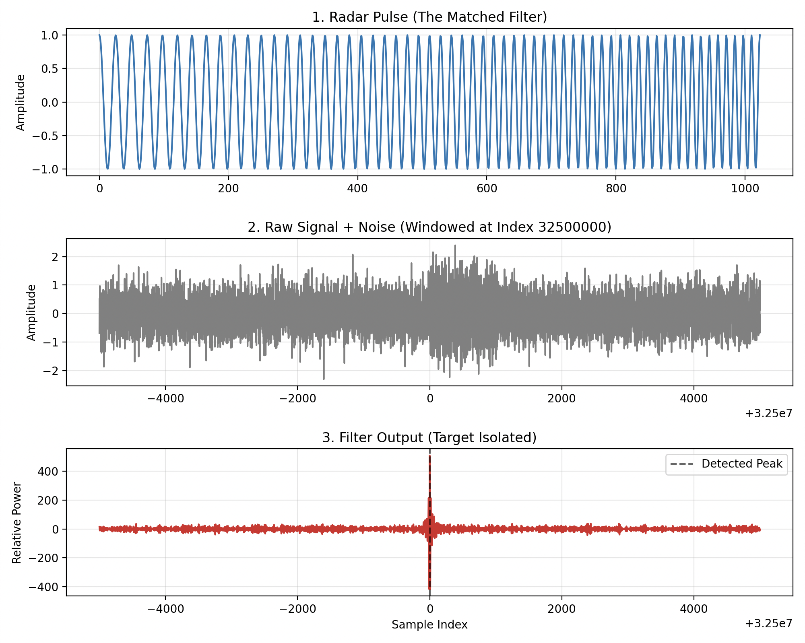

# PulseCompress - CUDA Matched Filtering


A GPU-accelerated digital signal processing pipeline built to execute matched filtering and pulse compression on massive radar datasets. 

## Performance & Optimization Metrics
The pipeline processes a simulated high-fidelity radar return consisting of **50,000,000 discrete samples** against a 1,024-point pulse envelope. 

Using **NVIDIA Nsight Compute (ncu)**, the kernel architecture was progressively optimized across three stages:
1. **CPU/Naive GPU Baseline:** Heavily bottlenecked by uncoalesced global memory reads.
2. **Shared Memory Tiling:** Eliminated the memory bottleneck by utilizing the L1 cache via cooperative block-strided loading and `__constant__` memory broadcasting.
3. **Thread Coarsening (Factor of 2):** Reduced integer instruction overhead by assigning multiple global outputs per thread, maximizing Register Reuse.

**Final Result:** The fully optimized kernel achieved **95.9% Compute Throughput**, proving the algorithm successfully saturated the Streaming Multiprocessor (SM) math units while preserving mathematical integrity.

## Visual Verification


## Architecture & Toolchain
* **Signal Generation (Python):** Generates binary target files (`.bin`) mimicking high-noise radar environments.
* **Build System (CMake):** Cross-platform out-of-source builds managing host/device compilation.
* **Compute Engine (CUDA C++):** Executes the highly parallelized convolution kernels.
* **Verification (NumPy/Matplotlib):** Reads binary outputs from the GPU and maps peak detection.
* **HPC Profiling (Slurm & ncu):** Deployed and profiled on shared computing clusters using batch scripting.

## Build and Run Instructions

**Prerequisites:** * NVIDIA GPU with CUDA Toolkit installed
* CMake (v3.10+)
* Python 3.x (with `numpy` and `matplotlib`)

**1. Clone and Build**
```bash
git clone [https://github.com/yourusername/PulseCompress-CUDA-Matched-Filtering.git](https://github.com/yourusername/PulseCompress-CUDA-Matched-Filtering.git)
cd PulseCompress-CUDA-Matched-Filtering
```
**2. Generate the Data**
```bash
bash generateData.sh
```
**3. Run the Kernels**
```bash
bash run_crossCor.sh
```
**4. Visualize the Output**
```bash
python display_data.py
```
**5. Run the Benchmark Script**
```bash
bash benchmark.sh
```
